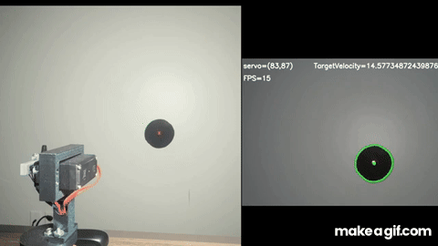

# Computer Vision Turret (CVT)

CVT is a real-time computer vision turret designed to track a moving black target from ~5 ft away and maintain alignment within one-fourth of the target’s area.  
The system combines proportional and predictive control and is split across a Raspberry Pi 5 (vision and logic) and a Raspberry Pi Pico (serove and laser control).

> This project was designed, built, tested, and documented independently.

## Skills Demonstrated

- Embedded systems architecture with delegated responsibility
- Computer vision with OpenCV
- Real time control concepts
- UART communication
- Data logging and statistical analysis
- Test design and performance evaluation
- Iterative debugging across software and hardware

### Mechanical Design

- Custom turret frame modeled in Fusion 360
- 3D printed structural and mounting componets
- Design iteration focused on rigidity, airflow, and quick iterations 

## System Architecture

### Raspberry Pi 5 (High-Level Control)
- Captures live video feed from webcam
- Performs computer vision using OpenCV
- Determines system state and target behavior
- Estimates target velocity and predicts future position
- Sends motion commands to the Pico over UART

### Raspberry Pi Pico (Real-Time Control)
- Receives commands from the Pi
- Converts desired angles into PWM signals
- Drives X/Y servos and toggles the laser

## Videos and Pictures

**Demo**  

**Full Test Footage**
- Static target test: [Here](https://youtu.be/bPHvd_qhFpg)
- Dynamic target test: [Here](https://youtu.be/34uFZd7rjXk)

### Build Photos

| Front | Side |
|------|------|
|  |  |

| Inside | Rear |
|--------|------|
|  |  |

## What It Does

- Detects a target in a live camera feed 
- Determines target position and laser position, then calculates pixel error
- Stores information of target and the turrets current state
- Applies proportional and predictive movement, deadbanding, and motion constraints
- Converts pixel error into servo motion commands
- Maintains tracking under target motion and noise
- Logs runtime data to CSV for performance analysis

## Control Loop Overview

1. Capture frame  
2. Threshold and filter to isolate target then laser  
3. Extract contours and select best candidate based on expected area and color  
4. Compute target center and pixel error  
5. Apply control logic (proportional + predictive)  
6. Send servo commands over UART  
7. Log timestamped data (position, error, velocity, state)

## Results and Performance

### Tracking Error vs Target Velocity
This plot compares tracking error against target velocity over time, highlighting the velocity range where the system performs reliably and where hardware limits (camera FPS) introduce error. You can see tracking error increase once target velocity exceeds ~125 px/s, which correlates with the system's frame rate and control update limits.

### Lock-In Time Histogram
Distribution of Lock-In times. Locked In was defined as remaining within one-fourth the area of the target for half a second. CVT averaged a lock in time of .98 seconds, with a standard deviation of .27 seconds. By the Lock-In definition, acquisition time is around .58 seconds.

### Limitations and Constraints

- Camera operates at ~15 FPS, limiting control update rate
- Higher target velocities (>125 px/s) increase tracking error
- Lighting conditions affect thresholding reliability

These constraints were intentionally measured and documented to define realistic system performance bounds. See [this log](data/sample/DYNAMIC_TARGET.csv) for documented framerate.

